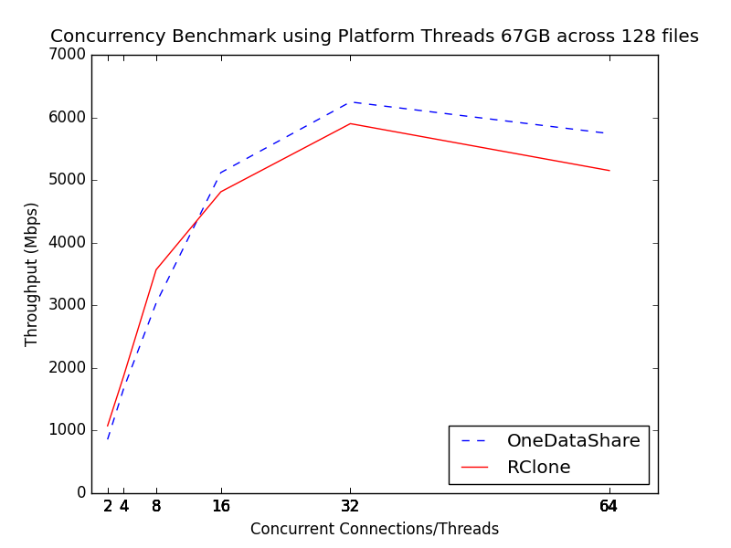
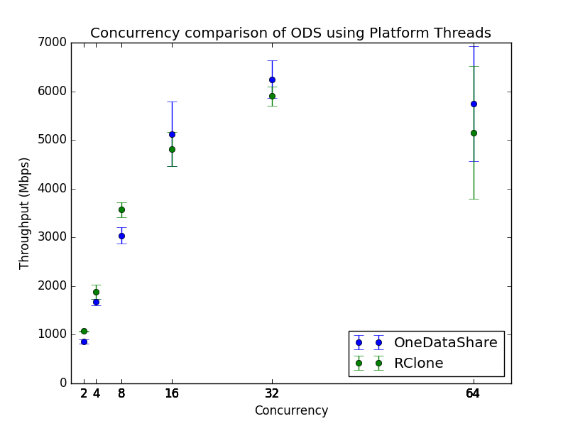
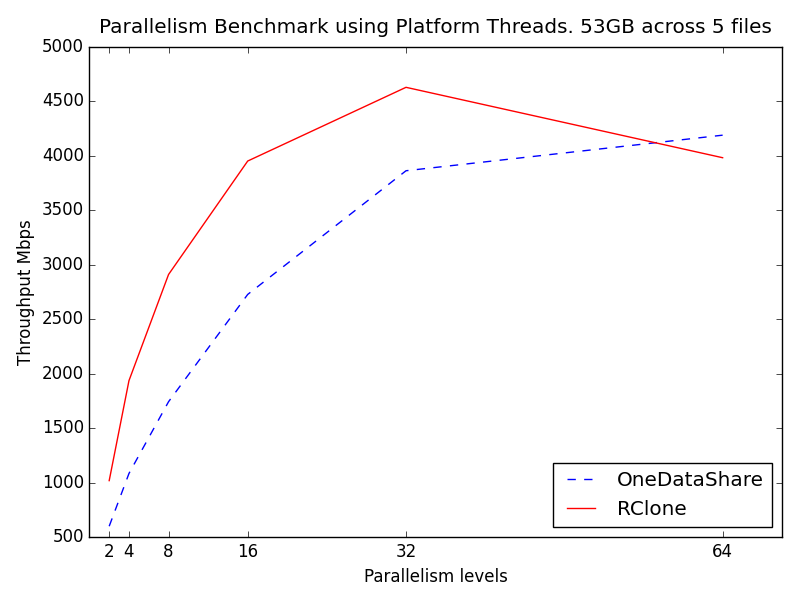
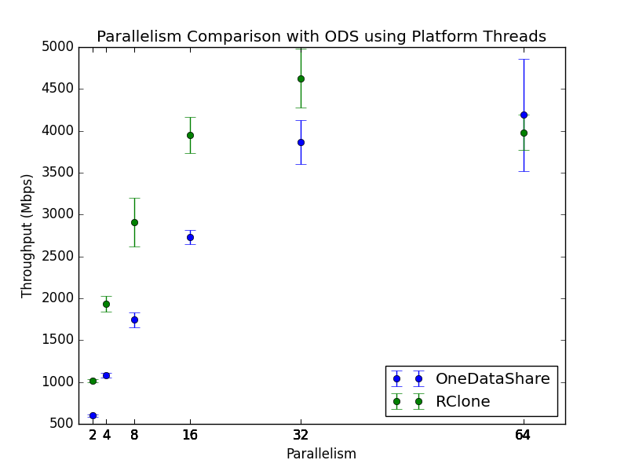
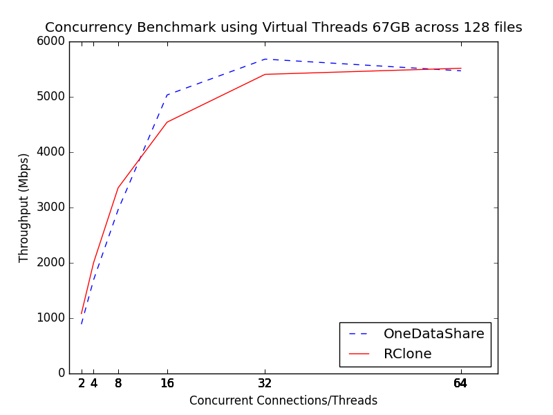
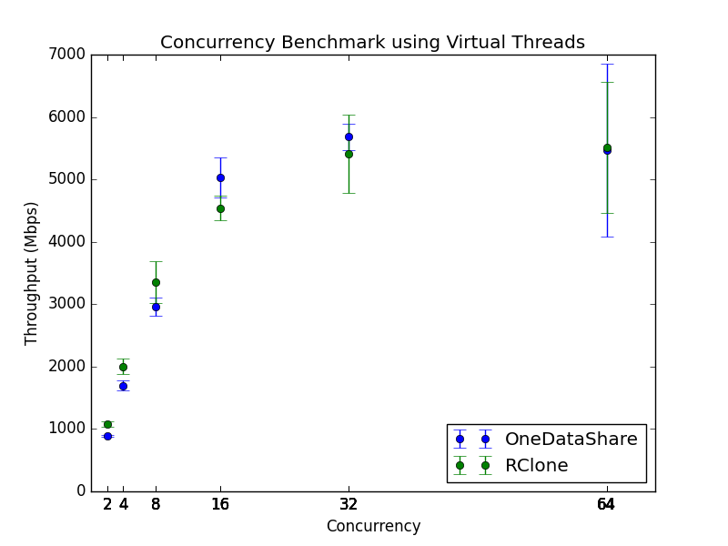
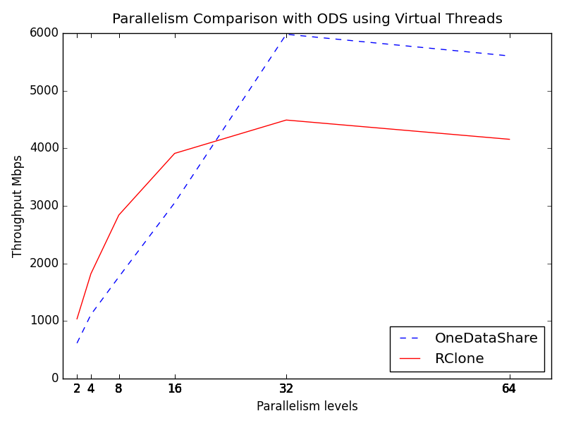
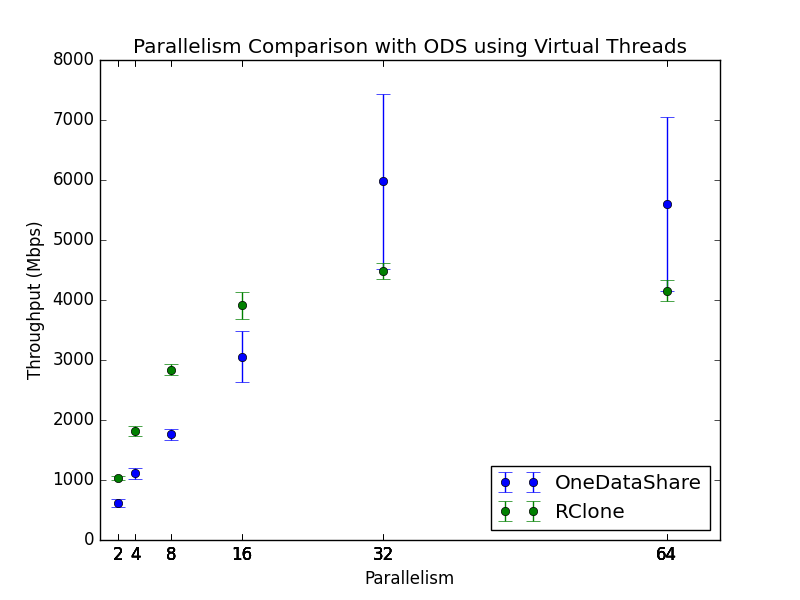

# Transfer-Service
The ODS Transfer Service

## Technology Stack
- Eureka <sub>(not required)</sub>
- CockroachDb<sub>(required)</sub>
- RabbitMQ <sub>(not required)</sub>
- Pmeter <sub>(not required)</sub>
- InfluxDB <sub>(not required)</sub>
to enable or disable any of these look in the application.properties file.
## Architecture
Let's begin with the understanding of what this service does. Strictly speaking the Transfer-Service moves data using many threads.
Before we get into the internals lets look at an api example.
```
{
    "ownerId": "jgoldverg@gmail.com",
    "source": {
        "credId": "httpTaccNginx",
        "type": "http",
        "fileSourcePath": "/",
        "resourceList": [
            {
                "path": "/parallel/",
                "id": "/parallel/",
                "size": 0
            }
        ]
    },
    "destination": {
        "credId": "jgoldverg@gmail.com-mac",
        "type": "vfs",
        "fileDestinationPath": "/Users/jacobgoldverg/testData/"
    },
    "options": {
        "compress": false,
        "encrypt": false,
        "optimizer": "",
        "overwrite": false,
        "retry": 5,
        "verify": false,
        "concurrencyThreadCount": 1,
        "parallelThreadCount": 1,
        "pipeSize": 10,
        "chunkSize": 10000000,
        "scheduledTime": "2023-10-25T14:52:15.183975Z"
    },
    "transferNodeName": ""
}
```
Let's begin with some verbiage clarification:
1. vfsDestCredential, vfsSourceCredential, oauthDestCredential, oauthSourceCredential are two sets of credentials to be found to access the source and the destination respectively. There is never a case where the api should have vfs and oauth, its XOR only for both source or destinatino depending on what kind of remote endpoint you are attempting to access.
2. Options, these options are fully described in the ODS-Starter documentation so please reference that.
3. Source: represents the source where we are downloading data from
4. Destination: represents the location where we are uploading data too.
5. OwnerId: This is a required field that corresponds to the user email of the onedatashare.org account

## How to run this locally.
Things to install:
1. Install Java 21
2. Install maven 3.9.5+
3. Get the boot.sh from Jacob or look at application.properties to pass in the appropriate credentials if you have your influx, and rabbitmq deployment.

## The way this works

Please read Language Domain of Spring batch first.
Using the above json as long as you replace the values appropriately you can run a transfer.
General things to know: 1 step = 1 file, ODS parallelism= strapping a thread pool to a step, ODS concurrency= splitting steps across a thread pool.
Connections are important, for us that entails pooling the clients, which honestly might not be the best idea for the cloud provider clients, but it works and compares/beats to RClone so.


So to start this service receives a message. Either as a request through the controller or the RabbitMQ consumer.
Once we get a request, we process which means running the code in JobControl.java, which all it really does it set up the Job object with the various steps.
This is where we apply a concurrency, parallelism and pipelining(commit-count, number of read calls to 1 write) by splitting the execution of many steps across a thread pool. Once we are done defining a Job we launch the job in the JobLauncher.
Once the job starts spring batch actually keeps track of the read, skip, write, ,,, counts in CockroachDB. Which means we can run many Transfer-Services that use the same Job table.

Once we have created 

### Helpful Links 

1. [Spring Batch Docs](https://docs.spring.io/spring-batch/docs/current/reference/html/)
   Sections: 
    - (Language Domain)[https://docs.spring.io/spring-batch/docs/current/reference/html/domain.html#domainLanguageOfBatch]
    - (Multi Threaded Steps)[https://docs.spring.io/spring-batch/docs/current/reference/html/scalability.html#multithreadedStep]
    - (Parallel Steps)[https://docs.spring.io/spring-batch/docs/current/reference/html/scalability.html#scalabilityParallelSteps]
    - few others as well but no point in listing them all
    
2. [AWS Java Docs](https://github.com/aws/aws-sdk-java-v2)
    Sections
   - Only worth reading about S3 stuff nothing else.
    
3. [Jsch Examples](http://www.jcraft.com/jsch/examples/)
    Here is the thing about Jsch THERE ARE NO DOCS. I know I hate it too sorry. So we have to go off examples and 
    stackoverflow BUT its actually a damn good library b/c it works similarly to how you would expect the ssh protocol to work
    Sections
    - Only read on stuff about Scp and Sftp, unless you are doing a remote execution which case 
      I would prob use Shell or Exec docs
      
4. [Dropbox Github](https://github.com/dropbox/dropbox-sdk-java)
   
5. [Box Docs](http://opensource.box.com/box-java-sdk/)

6. [Google Drive Docs](https://developers.google.com/drive/api/quickstart/java)
   
7. [Influx Docs](https://github.com/influxdata/influxdb-java)

8. [Spring JPA](https://docs.spring.io/spring-data/jpa/docs/current/reference/html/)
    I would only look this over if you plan on working with the Data otherwise not very necessary

## Features Implemented - Spring 2023

| No.| Feature                                                     | Branch name                                                                                           |
|----|-------------------------------------------------------------|-------------------------------------------------------------------------------------------------------|
| 1  | HTTP Pipelining for Reader using Apache HTTP client library | [origin/vn/httppipelining](https://github.com/didclab/Transfer-Service/tree/origin/vn/httppipelining) |
| 2  | Added support for WebDAV reader and writer                  | [origin/vn/webdav](https://github.com/didclab/Transfer-Service/tree/origin/vn/webdav)                 |

## Performance

Ok so currently we have done some benchmarking against RClone here are some of the graphs we got.
The physical link capacity is 10Gbps as that is the nic used on chameleon cloud skylake nodes. Nginx is the file source running as HTTP 1.1 file server.
We are gonna explore different version soon.

So why did we pivot to java 21 so fast?? Well the idea of Virtual Threads aligns really well with the idea of this service.
Set of Graphs showing results of parallelism and concurrency on platform threads.





Some graphs using the new "Virtual Threads", highly similar to goroutines.






We are currently exploring using jetty once its supported by the latest spring 3.2.0 and then we should be all set to run at a low memory footprint.

